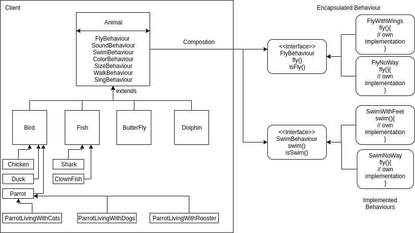

# Singtel Assigment

## Overview
##### Animals modelling and rest-apis

##### RestApis Doc (Swagger UI) - http://localhost:8090/swagger-ui.html

## Getting Started

These instructions will get you a copy of the project up and running on your local machine for development and testing purposes.

### Prerequisites

What things you need to install the software and how to install them

1. **JAVA 8**: [Install](https://www.oracle.com/technetwork/java/javase/overview/java8-2100321.html) It is requrired as application uses spring boot.
2. Replace this path "/home/sanjayk/Paytm/demo" in application-dev.properties with any directory on your system
### Installing

#### Local Installation

1. Clone the repository via ssh/http.
2. Run this command 'mvn spring-boot:run' from root of the project

Hit `http:localhost:8090/` with all the API routes and go to the homepage.

You can now proceed to test the APIs using Postman or implement new features.